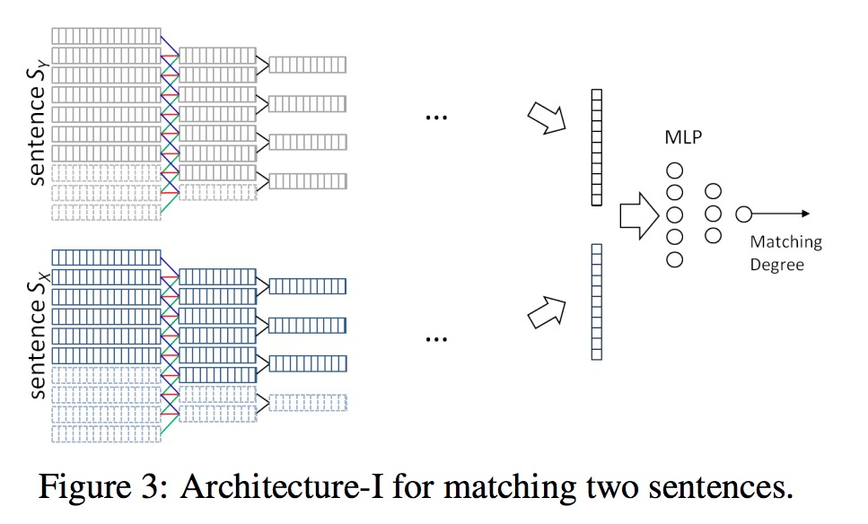
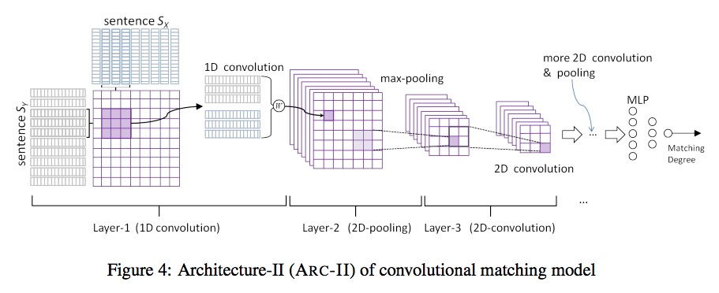
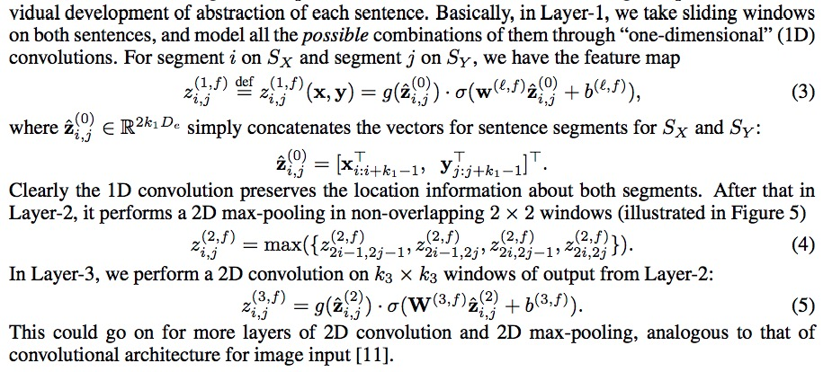

#深度语义匹配模型系列 -- ARC
Convolutional Neural Network Architectures for Matching Natural Language Sentences

Baotian Hu， Zhengdong Lu， Hang Li， Qingcai Chen

ARC 模型有两个变体，ARC-I 和 ARC-II。第一种是基于表示的方法，模型先提取两个句子的语义表达，然后使用多层感知器比较两个语义向量；第二种是基于交互的方式。

## Architecture-I (ARC-I)


该模型具有孪生结构，因此也继承了孪生机构模型的缺点，比如在全连接层之前，两个句子所提取的语义特征没有进行任何的交互，这样可能导致在提取特征时损失了一些重要的可以用来做语义匹配的语句细节；换句话说就是，在模型的前向过程中相匹配的两个句子的语义表达彼此之间不包含对方的任何信息，这使得在后向（反向传播）过程中卷积模型不能充分提取到一些必要的特征。

## Architecture-II (ARC-II)

基于结构 ARC-I 的缺陷，ARC-II 模型在提取句子结构的高级特征之前就让两个句子的表达向量进行交互，同时保留两个句子的特征抽象发展空间。


模型能够保持语句中的顺序结构，实验证明 ARC-II 在三元组样本 $$(S_X,S_Y,\overline S_y)$$ （$$\overline S_y$$是在$$S_Y$$的基础上随机打乱语句顺序）中，有能力找到正确匹配句子$$S_Y$$的概率比$$\overline S_y$$高，但在模型ARC-I 中不会这样。

## 训练
###ranking-based 代价损失函数
$$e(X,y^+,y^-;\theta) = max(0,1+s(X,y^-)-s(X,y^+))$$

$$s(X,y)$$ 表示句子 x，y 之间的匹配分数，三元组$$(X,y^+,y^-)$$表示 X 匹配 y+ 高于 y-。

在正则化技术选择方面，作者发现，对于中型或大型数据集（50W样本以上）两种结构模型只要使用早停就行；而对于 10万样本的数据集需要结合早停和 dropout 技术以防止过拟合。

We use 3-word window throughout all experiments2 , but test various numbers of feature maps (typically from 200 to 500), for optimal performance. ARC-II models for all tasks have eight layers (three for convolution, three for pooling, and two for MLP), while ARC-I performs better with less layers (two for convolution, two for pooling, and two for MLP) and more hidden nodes. We use ReLu [7] as the activation function for all of models (convolution and MLP), which yields comparable or better results to sigmoid-like functions, but converges faster.

##Experiment I: Sentence Completion
This is an artificial task designed to elucidate how different matching models can capture the correspondence between two clauses within a sentence.

```
S_X: Although the state has only four votes in the Electoral College,
S^+_Y: its loss would be a symbolic blow to republican presidential candi
date Bob Dole.
S^−_Y: but it failed to garner enough votes to override an expected veto bypresident Clinton
```

##Experiment II: Matching A Response to A Tweet
For each positive pair, we find ten random responses as negative examples, rendering 45 million triples for training. One example (translated to English) is given below, with $$S_X$$ standing for the tweet, $$S^+_Y$$ the original response, and $$S^−_Y$$ the randomly selected response:

```
S_X: Damn, I have to work overtimethis weekend!
S^+_Y: Try to have some rest buddy.
S^−_Y: It is hard to find a job, better start polishing your resume.
```

##Experiment III: Paraphrase Identification
判断两句话是不是同义句。

Nevertheless, our generic matching models still manage to perform reasonably well, achieving an accuracy and F1 score close to the best performer in 2008 based on hand-crafted features, but still significantly lower than the state-of-the-art (76.8%/83.6%)
